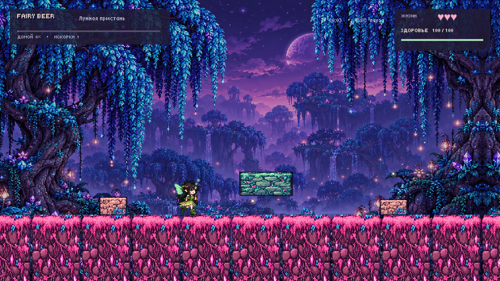

# Fairy Beer — Chibi

Fairy Beer is a pixel-art 2D platformer built in Unity 6. The player guides a tipsy fairy across the alien island of the Drunken Cuttlefish, where every direction is reversed and the route changes on each new attempt.

## Portfolio snapshot

- Concept and requirements: Zlatoslava. Implementation and production assistance: Codex. This is a learning project, not a claim of independent professional experience.
- Engine: Unity 6000.4.7f1, Windows x64
- Visual direction: high-detail 16-bit pixel art, blue willow forest, pink crystal earth, peach and mint obstacles, sakura tree-house finale
- Playtime target: approximately 20 minutes for the full route, preceded by an optional two-minute tutorial
- Controls: A/Left moves right; D/Right moves left; S/Down jumps; W/Up crouches; Space/J swings the bottle

## Systems

The game combines a deterministic seeded map generator with dense obstacle groups, overhead blocks, lower blocks, flowering vines, healing bottles, pterodactyl dives, checkpoint lanterns, three lives and fog debuffs after the first two deaths. The final route ends at a sakura tree-house and a dedicated ending scene.

## Technical notes

Keyboard input is intentionally isolated from Unity's legacy axis bindings so the reversed A/D controls cannot cancel themselves out. Gamepad axes use separate bindings with a dead zone. The project includes automated assertions for generation, collision clearance, jumping, crouching, bottle attacks, life loss and the input regression.

The latest Windows build is `Builds/Windows/FairyBeer.exe`. `README.md` describes version 2.2.0, including wooden pixel UI, graphics settings, a protected 120-second tutorial, eight-frame enemies and swinging vines. `QA/INPUT_FIX_RU.md` documents the earlier input investigation.
