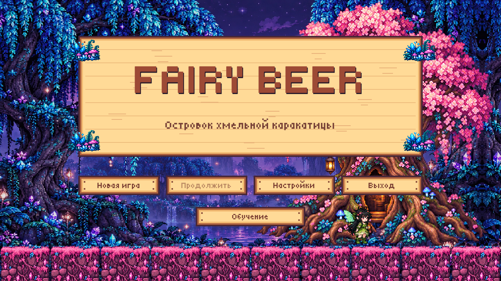

# Пробный проект Unity — Fairy Beer

Учебный 2D-платформер на **Unity 6 и C#** для Windows x64. Игрок ведёт фею Лиру домой через Островок хмельной каракатицы. Её направления движения перепутаны, а расположение препятствий меняется при новой игре.

## Запуск

Распакуйте весь архив `Releases/FairyBeer-Windows.zip` и запустите `FairyBeer.exe`. Исполняемый файл работает вместе с папками и библиотеками из архива. Unity для запуска не требуется.

Для работы с исходниками откройте корень проекта в Unity **6000.4.7f1**, затем сцену `Assets/Scenes/Island.unity`. Меню редактора `Chibi → Build Windows game` проверяет проект и собирает Windows-версию.

## Механики

- Инвертированные направления: A/← ведёт вправо, D/→ — влево; S/↓ — прыжок, W/↑ — приседание.
- Удар бутылкой на Space/J, который срубает лозы и отгоняет врагов.
- Двухминутное обучение: пять площадок по 24 секунды с неограниченными жизнями и возможностью пропуска.
- Процедурная генерация по seed: нижние блоки, узкие верхние проходы, разрывы земли, ступени, грибные и кристальные препятствия.
- Цветущие лозы, включая качающиеся под верхними блоками: движущаяся область попадания наносит 30 урона.
- Пиксельные птеродактили с восемью кадрами полёта, пикированием и анимацией исчезновения после удара.
- Сова атакует после четырёх секунд без движения и наносит 80 урона.
- 100 здоровья, три жизни, временная неуязвимость и усиливающийся туман после потери жизни.
- Контрольные точки, JSON-сохранения, лечебные предметы и сбор искорок.
- Меню, пауза, финал; настройки разрешения, оконного режима, VSync, частиц и музыки.

## Устройство проекта

`ChibiGame.cs` содержит состояния игры, генерацию, расчёт движения и столкновений. Физика использует фиксированный шаг 1/120 секунды, coyote time и буфер прыжка. `ChibiPresentation.cs` содержит оформление, настройки, обучение и пиксельную анимацию врагов. Это компактный учебный проект; дальнейшее улучшение архитектуры — разделение систем на самостоятельные компоненты.

`ChibiBuild.cs` проверяет генерацию на 100 seed, инверсию ввода, движение, прыжки, приседание, жизни и удары. Проверочный проход готовой сборки запускается с `--autotest --capture <путь.png>`; он использует временное сохранение и ускоряет достижение финала. Это не замена ручному прохождению полного уровня.

## Авторство и материалы

Автор идеи и требований — Zlatoslava. Проект разрабатывается как учебная работа начинающего Unity/C# разработчика с помощью Codex: помощь в реализации, проверках и подготовке материалов. Иллюстрации окружения и персонажа подготовлены с помощью генеративных инструментов; исходники и описания находятся в `Assets/ArtSource`. Пиксельные враги и деревянные панели рисуются программно. Музыка создаётся скриптом `Tools/compose_music.py`.

Шрифт [Tiny5](https://github.com/Gissio/font_tiny5) распространяется по SIL Open Font License; лицензия включена в `Assets/Resources/Fonts/Pixel-LICENSE.txt`. Референсы Stardew Valley использованы для направления оформления, её файлы и логотип в игру не включены.

## Статус

Версия 2.2.0. Целевая платформа — Windows x64, управление клавиатурой. Ввод геймпада предусмотрен, проверка на физическом устройстве ещё требуется. Полный маршрут рассчитан примерно на 20 минут; реальное время зависит от игрока.